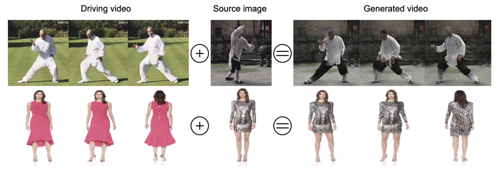

# DwNet

This is the code repository complementing the paper ["DwNet: Dense warp-based network for pose-guided human video generation"](https://arxiv.org/abs/1910.09139).  The pretrained models are included in the repo.


Teaser  |  Quantitive results evaluation.
:-------------------------:|:-------------------------:
 | 

## Dependencies and Setup

- Python 2.7.12
- numpy==1.15.0
- dominate==2.3.4
- torch==1.0.1.post2
- scipy==1.1.0
- matplotlib==2.2.3
- torchvision==0.2.1
- tensorflow_gpu==1.11.0
- Pillow==7.2.0
- tensorflow==2.2.0


## Experiments

### Datasets


### Test
```bash
python test.py --name taichi_best  --dataroot datasets/taichi_test/  --nThreads 1  --loadSize 256  --gpu_ids 0  --prev_frame_num 3
```

To test the transfer between different videos:

```bash
python test.py --name taichi_best  --dataroot datasets/taichi_test/  --nThreads 1  --loadSize 256  --gpu_ids 0  --prev_frame_num 3 --transfer --transfer_file ./datasets/taichi_pairs.csv
```

\-\-transfer_file points to a file with pairs of folders, where the first folder is a source for the frame to be transferred onto the driving video from the second column. Since we have just two examples in the test datasets, we only have two rows of pairs.


### Train 

To train from scratch you should use this command:
```bash
python train.py --name testing_taichi  --dataroot ../path/to/the/train/dataset --batchSize 8 --gpu_ids 0 

```

If you want ot load a pretrained model then please use a flag \-\-load_pretrained:
```bash
python train.py --name testing_taichi  --dataroot ../path/to/the/train/dataset --batchSize 8 --gpu_ids 0 --load_pretrain checkpoints/taichi_best/
```

This would load the model that is included in the repo. 
